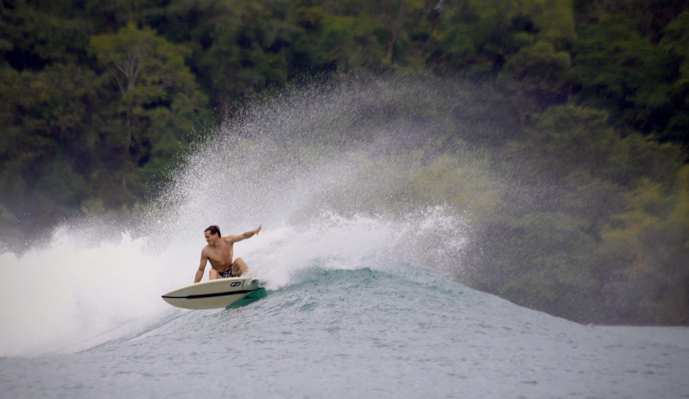

# Itai's User Page:

## About Me:
Hi! I'm Itai, a bioinformatics major and CSE minor at UCSD interested in AI, medicine, and building innovating med-tech tools. Check out my professional profile on [LinkedIn](https://www.linkedin.com/in/ilavi/)!
 
**My Hobbies**: I love to surf, hike, *play and watch* basketball. (to see photos of me surfing, navigate to [my vacation photos](####picture-from-panama))

Here is a quote from my favorite artist Mac Miller:
 >Enjoy the best things in your life 'cause you ain't gonna get to live it twice.
---

## Markdown Utilities

### Code Block:
<pre> ```python print("hello world") ``` </pre>

### Ordered List - My Favorite Foods:
1. Poke
2. Tacos
3. Steak

### Unordered List - Vacation Spots I've been to
- San Fransisco
- Panama
- Iceland
- Portugal

#### Picture from Panama:


### Task List - Vacation Spots I want to go to:
- [x] Iceland
- [ ] Australia
- [ ] Morroco

### Relative Link:
[Go to README](README.md)


